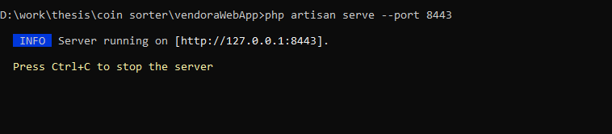

# Vendora
## Installation Instructions
- Download php 8.1+ in the php official page
- Download latest composer
- Install the downloaded composer
- After successfully installing composer, clone this project using git bash by this command `git clone https://github.com/MakMoinee/vendoraWebApp.git `
- Go to the clone repository directory by opening cmd > `cd vendoraWebApp`
- Type in the cmd > `composer install`
- If you encounter errors, please enable the php.ini by running this in cmd > `php --ini`
- After that, open the php.ini file in the folder where your php is located.
- Open the php.ini in either wordpad, notepad or notepadd++, then search for the following:
exif,gd2,pdo_mysql,file_ext
- enable the extension by removing `;` in the php.ini file.
- save the php.ini and run in the cmd `php --ini`
- rerun again the `composer install` in cmd with the same directory where your cloned project is located
- after successful execution of `composer install`, type `npm install` in cmd.
- after successful execution of `npm install`, type `npm run dev` in cmd.
- after successful execution of `npm run dev`, copy paste the file ``.env.example``
- remove the suffix `.example copy` in ``.env.example copy``, just leave it as `.env`
- run the command `php artisan storage:link` in the cmd.

## Running the server with CMD
- Open cmd where your project is located.
- Type the command `php artisan serve --port 8443` to start the server

- Open a browser, and browse the url ``http://localhost:8443``

## Running the server with .bat file
- Open start_service.bat

- Open a browser, and browse the url ``http://localhost:8443``